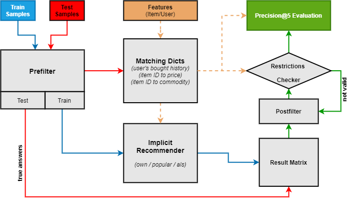

# Retail Recommender Systems Project Solution

[Located at ./Final_prj](https://github.com/Nickel-nc/GU_Rec_Systems/tree/master/Final_prj)

## Overview

Unpacked Demo Sandbox:

[FP_Test.ipynb](https://github.com/Nickel-nc/GU_Rec_Systems/blob/master/Final_prj/FP_Test.ipynb)

Main Module:

[Run_1lvl.py](https://github.com/Nickel-nc/GU_Rec_Systems/blob/master/Final_prj/Run_1lvl.py) + [src](https://github.com/Nickel-nc/GU_Rec_Systems/tree/master/Final_prj/src) folder

### Run project locally

```
cd {REPO_FOLDER}

# Copy initial data

$ mkdir -p ./item-recommender-app/data
$ cp /path/to/unpacked/data/*.csv ./data
$ python Run_1lvl.py
```

`docker run nickelnc/item-recommender-app` - Run demo from container

### Features

Hybrid recommender (als + own + popular)

#### Restrictions:

- @5 recommendations
- only > 1$ cost items @ rec
- 2 new items @ rec
- at least 1 expensive item > 7 $ @ rec
- different commodities (unique sub_commodity_desc) @ rec

### One Level Data Flow



### Results
Scores (MoneyPrecision@5)

| Type | Score |
| ------ | ------ |
|Train-split baseline| 0.2 |
|Two-level train-split baseline | 0.14 |
|Public test baseline consider restrictions | 0.07 |
|Lowest score| 0.034|
|Final Public score| 0.277897 |


